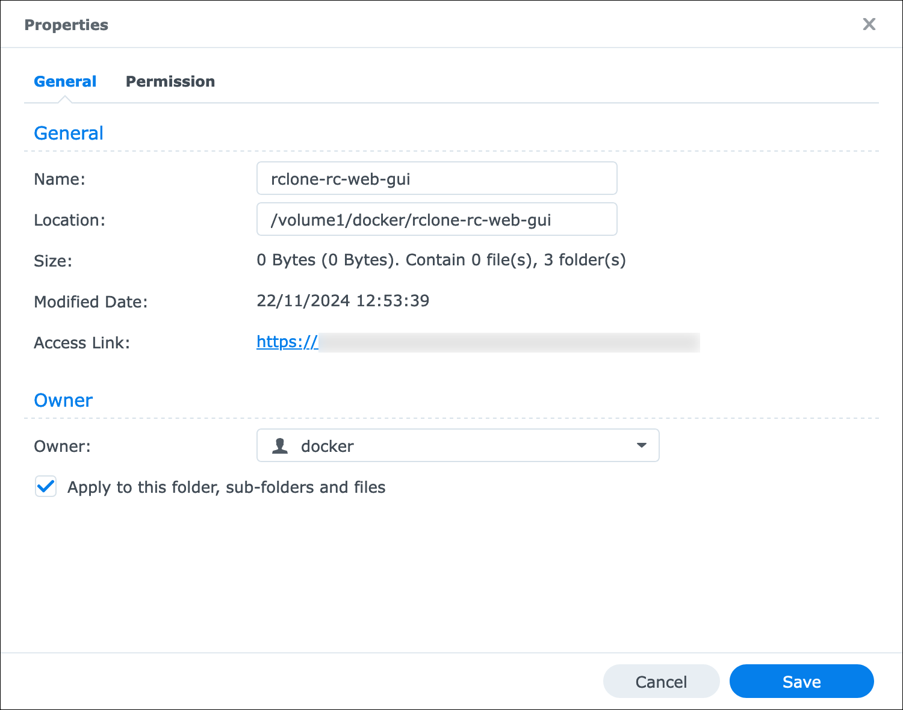
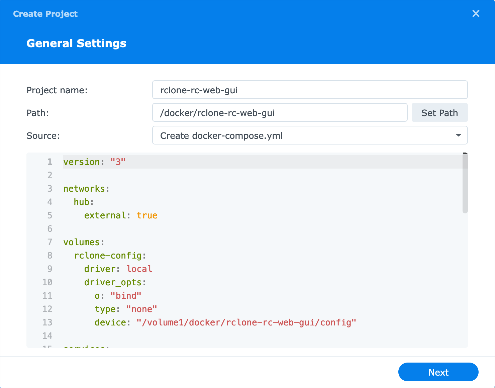
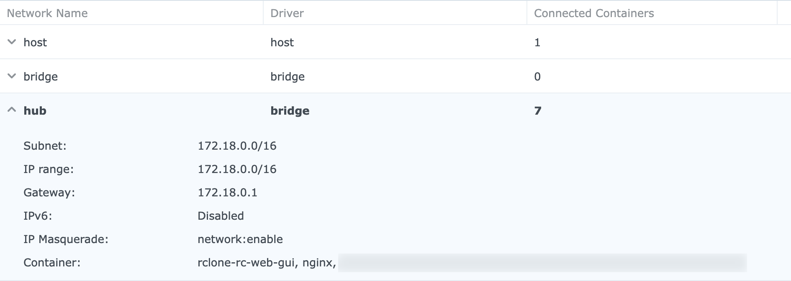
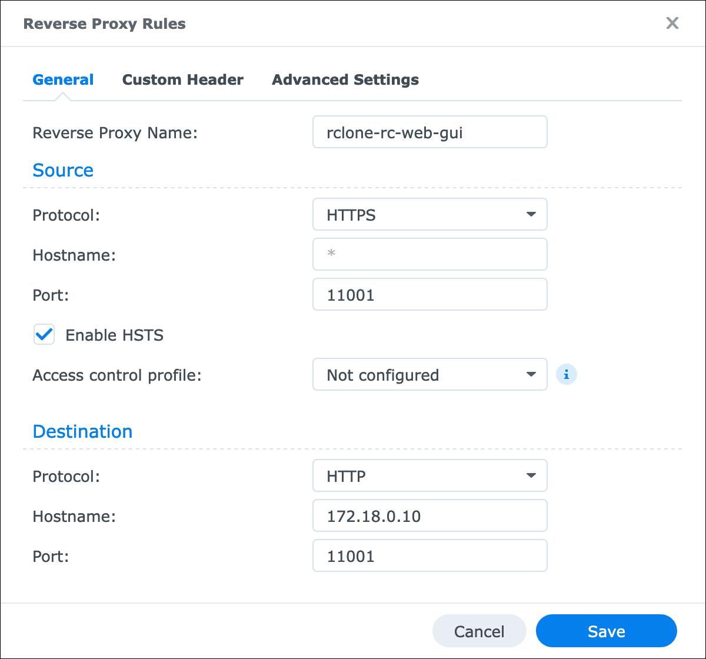

# Docker

How to build an image and run a container from it.

<!-- MarkdownTOC -->

- [Getting an image](#getting-an-image)
    - [Pre-built](#pre-built)
    - [Building](#building)
- [Running a container](#running-a-container)
    - [Upgrading from an older image](#upgrading-from-an-older-image)
    - [Generic host with Docker](#generic-host-with-docker)
    - [Synology DSM with Container Manager](#synology-dsm-with-container-manager)

<!-- /MarkdownTOC -->

## Getting an image

### Pre-built

There is a pre-built image published at [Docker Hub](https://hub.docker.com/r/decovar/rclone-rc-web-gui), so you can pull it:

``` sh
$ docker pull decovar/rclone-rc-web-gui
```

If you are on an ARM host, then pulling might fail like this:

```
no matching manifest for linux/arm64/v8 in the manifest list entries
```

so then you'd need to specify the platform by adding `--platform linux/amd64`.

### Building

Or you can build your own image:

``` sh
$ cd /path/to/rclone-rc-web-gui
$ ./docker/prepare-for-building-the-image.sh

$ cd ./docker
$ export IMAGE_NAME='rclone-rc-web-gui'
$ export RCLONE_VER='1.75.0'
$ export GUI_VER='2026.8.2'

$ docker build . \
    --build-arg RCLONE_VERSION_VALUE="v$RCLONE_VER" \
    --tag $IMAGE_NAME:"rclone_$RCLONE_VER-gui_$GUI_VER" \
    --tag $IMAGE_NAME:"latest"

$ docker images
REPOSITORY          TAG                       IMAGE ID       CREATED          SIZE
rclone-rc-web-gui   latest                    94468b279531   14 minutes ago   92.4MB
rclone-rc-web-gui   rclone_1.68.1-gui_0.5.0   94468b279531   14 minutes ago   92.4MB
alpine              latest                    511a44083d3a   2 months ago     8.83MB
```

The build requires [BuildKit](https://docs.docker.com/build/buildkit/), which is what `docker build` uses by default since Docker [v23](https://docs.docker.com/engine/release-notes/23.0/). You can disable it with `DOCKER_BUILDKIT=0`, but then the build will fail, because `TARGETARCH` will become unset and that will fail the rclone download.

If you are building on an ARM-based host but will use the image on a x64-based host (*or the other way around*), then add `--platform linux/amd64` to the `docker build` command. To get a single multi-platform image, use `buildx` and push it straight to a registry (*because multi-platform images can not(?) be loaded into the local image store*):

``` sh
$ docker buildx build . \
    --platform linux/amd64,linux/arm64 \
    --build-arg RCLONE_VERSION_VALUE="v$RCLONE_VER" \
    --tag $IMAGE_NAME:"rclone_$RCLONE_VER-gui_$GUI_VER" \
    --push
```

## Running a container

### Upgrading from an older image

If you haven't used this image before, just skip to the next section. Otherwise, if you are upgrading from a version before [2026.8.2](https://github.com/retifrav/rclone-rc-web-gui/releases/tag/v2026.8.2), be aware that rclone config has been moved from `/home/rclone/.config/rclone/rclone.conf` to `/config/rclone.conf`, and also that container no longer needs a named volume for it. Good news is that the only thing you need to change is that one mount, because your `rclone.conf` is likely to be located in that host folder already:

``` diff
- -v rclone-config:/home/rclone/.config/rclone
+ -v /path/to/dckr/config:/config
```

And also delete the whole top-level `volumes:` block with `driver_opts` in your `docker-compose.yaml` (*if you have it at all*).

### Generic host with Docker

First create the folders for rclone config, data and web UI settings - those are your persistent data (*what will survive between container restarts*):

``` sh
$ mkdir -p /path/to/dckr/{data,config,settings}
```

The container accesses those folders as user `rclone` with UID `1000`, so they have to be owned by that UID:

``` sh
$ chown -R 1000:1000 /path/to/dckr/{data,config,settings}
```

If you can't or don't want to change those folders ownership, then run the container as whoever owns them instead:

- `--user 1027:100` for `docker run`;
- or `user: "1027:100"` in `docker-compose.yaml`.

One thing to keep in mind if you choose to do that: a UID that the image doesn't have in its `/etc/passwd` will get `HOME=/`, so rclone will no longer find SSH keys in `~/.ssh`, unless you also add `-e HOME=/home/rclone` or set `key_file` explicitly in the remote's config.

If you already have an `rclone.conf`, simply put it into the `config` folder before starting the container, and rclone will pick it up.

To create and run a container:

``` sh
$ docker images
REPOSITORY          TAG                       IMAGE ID       CREATED          SIZE
rclone-rc-web-gui   latest                    94468b279531   14 minutes ago   92.4MB
rclone-rc-web-gui   rclone_1.68.1-gui_0.5.0   94468b279531   14 minutes ago   92.4MB
alpine              latest                    511a44083d3a   2 months ago     8.83MB

$ docker run -it -p 5572:5572 \
    -v /path/to/dckr/data:/data \
    -v /path/to/dckr/config:/config \
    -v /path/to/dckr/settings:/var/www/rclone-rc-web-gui/js/settings \
    -e TZ=Europe/Amsterdam \
    -e RCLONE_USER=rclone \
    -e RCLONE_PASS=s0m3pa55w0rd \
    --rm \
    94468b279531
```

Important to note that credentials (*`RCLONE_USER` and `RCLONE_PASS`*) must be set, otherwise container will refuse to start.

You might also want to override some of these variables (*with `-e SOME=THING`*):

- `RCLONE_ALLOW_ORIGIN_SCHEME`;
- `RCLONE_ALLOW_ORIGIN_HOST`;
- `RCLONE_ALLOW_ORIGIN_PORT`.

If you are going to add SFTP remotes with SSH keys based authentication, then you will probably want to map the `~/.ssh` folder too, for example with `-v /path/to/dckr/ssh:/home/rclone/.ssh`.

You can take a look at a set of example values [below](#synology-dsm-with-container-manager).

### Synology DSM with Container Manager

Here's also an example of using this image to run a container in Synology DSM [Container Manager](https://synology.com/en-global/dsm/feature/docker).

Being tailored to my needs, this particular setup has certain specifics, which you might not necessaryly want to have in yours, namely:

- the container data folders are owned by a specially created `docker` system user, which has no access rights to anywhere but that one dedicated `/volume1/docker/` folder;
- the container port `5572` isn't mapped to the host, as instead there is also an NGINX container running, who serves as a reverse-proxy for it (*and other containers in that particular Docker network*);
- that NGINX container is in turn also not mapping its ports to host - instead it's Synology DSM Login Portal who exposes NGINX container ports via the [Reverse Proxy](https://kb.synology.com/vi-vn/DSM/help/DSM/AdminCenter/system_login_portal_advanced?version=7#b_5) feature;
    - this intermediate step of having NGINX container might seem redundant, and you can actually reverse-proxy the containers "directly", but in that case you won't be able to access them by names, so instead of having one static IP address of just the NGINX container, you will have to use static IP addresses of every single container, which is less convenient.

...so if your setup is different, you will need to adjust the following instructions accordingly.

First, create a folder for storing the container data - what needs to "survive" between container restarts/rebuilds. I've put mine into `/volume1/docker/rclone-rc-web-gui/`. Inside that path create folders for `data`, `settings` and `config`. Then make `docker` user to be the owner of those folders (*that part I am not sure about, but I thought it wouldn't hurt to have a dedicated "unprivileged" user as the owner*):



Once again about the UIDs: container accesses those folders as `rclone` user with UID `1000`, while a DSM system user like this `docker` above gets whatever UID the DSM has assigned to it, which is most likely not `1000`. So either `chown -R 1000:1000` those folders, or keep them owned by `docker` and tell the container to run as that user by adding `user: "UID:GID"`. If the UID can't write, the container won't start (*it should exit with an explicit error*).

Open Container Manager and create a new project:



Here's the full `docker-compose.yaml` contents:

``` yaml
version: "3"

networks:
  hub:
    external: true

services:
  server:
    image: decovar/rclone-rc-web-gui:latest
    container_name: rclone-rc-web-gui
    restart: unless-stopped
    environment:
      - TZ=Europe/Amsterdam
      # my DSM serves the web content via HTTPS
      - RCLONE_ALLOW_ORIGIN_SCHEME=https
      # that is the IP address of my Synology NAS host in my home network
      - RCLONE_ALLOW_ORIGIN_HOST=192.168.1.100
      # that public port on my Synology NAS exposed via Reverse Proxy in Login Portal
      - RCLONE_ALLOW_ORIGIN_PORT=11001
      # username for Basic authentication
      - RCLONE_USER=rclone
      # password for Basic authentication
      - RCLONE_PASS=s0m3pa55w0rd
    networks:
      hub:
        # static IP address for the container, which isn't really needed for this one,
        # as it will be accessed by NGINX container via name, not IP address. But while
        # we are here, this is how NGINX container gets its static IP address 172.18.0.10
        ipv4_address: 172.18.0.11
    volumes:
      # default local remote path, which doesn't even have to be mapped, if you don't intend to use it
      - /volume1/docker/rclone-rc-web-gui/data:/data
      # if the user config with remotes is not in that folder already,
      # container will create it on the first ever start
      - /volume1/docker/rclone-rc-web-gui/config:/config
      # although web UI settings are stored in just one file, its entire parent folder
      # has to be mapped instead, otherwise Docker will create an empty folder
      # named after that file, which is what caused that retarded workaround
      # with moving the `settings.js` file into a subfolder
      - /volume1/docker/rclone-rc-web-gui/settings:/var/www/rclone-rc-web-gui/js/settings
      # SSH keys
      - /volume1/docker/rclone-rc-web-gui/ssh:/home/rclone/.ssh
```

On the next step, don't set-up a web portal for it, just click Next till the end.

If you don't yet have a custom network, container creation will fail. So create a new network with the driver `bridge` - that will allow you to refer to containers by their names. Here's how my network `hub` looks like:



And then for NGINX container you add the following website configuration (*`/volume1/docker/nginx/data/conf.d/rclone-rc-web-gui.conf`, in my case*):

``` nginx
server {
    listen 11001;

    location / {
        proxy_pass http://rclone-rc-web-gui:5572;
        proxy_set_header Host $host:$server_port;
        proxy_set_header X-Forwarded-Proto https;
    }
}
```

Finally, here are the settings for Reverse Proxy in Login Portal:



The `172.18.0.10` on the screenshot is the static IP address of the NGINX container in that same custom Docker network named `hub`.

This is it, once you build and run the container, the GUI should become available at <https://192.168.1.100:11001>, and `rclone rc` requests should satisfy the CORS policy.
